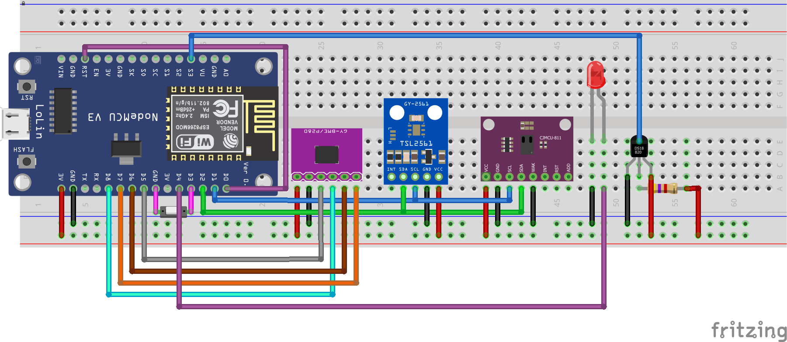
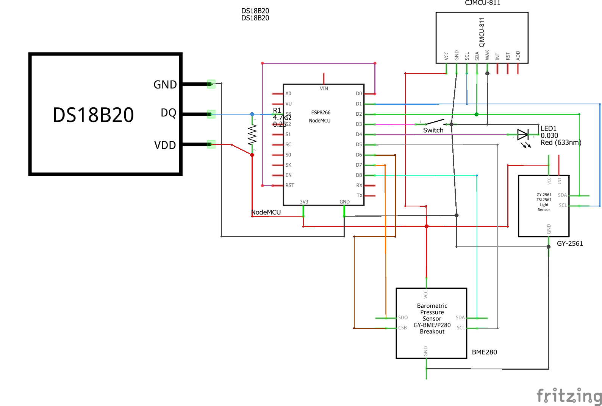

# Ambient sensor station
This station implements basic ambient sensing functionalities including temperature, humidity, pressure, air quality and brightness.

The main intent for me is to use this inside e.g. the living or sleeping room. However the basis without the air quality sensor can be used in many other rooms or scenarios as well.

Note: As this is developed to work in a productive environment the system uses the "deep sleep" state of the ESP8266.

Note: The values in this scenario are transmitted on multiple different MQTT channels as single values. This makes it simple but a switch to JSON based is planned for the future.

## Components
* NodeMCU v3 ([Documentation](https://nodemcu.readthedocs.io/en/master/))
* Adafruit Bosch BME280 sensor ([Documentation](https://www.adafruit.com/product/2652))
* Adafruit CCS811 sensor ([Documentation](https://www.adafruit.com/product/3566))
* Adafruit TSL2561 sensor ([Documentation](https://www.adafruit.com/product/439))

## Connection
* BME280 @ SPI
* CCS811 + TSL2561 @ I2C

## Breadboard view


## Schematics


## Logging output example
```
> 13:29:48.765 -> Setup initialised!
> 13:29:49.279 -> Connected to Wi-Fi!
> 13:29:49.279 -> Local IP address: 192.168.0.44
> 13:29:49.279 -> Hostname: ESP-LIVING
> 13:29:49.279 -> OTA setup successfull!
> 13:29:49.279 -> Initialising connection to MQTT broker...
> 13:29:49.313 -> Connected to broker!
> 13:29:49.722 -> Setup: Successfull!
> 13:29:49.756 -> Brightness = 60.00 lux
> 13:29:49.756 -> Temperature = 20.61 °C
> 13:29:49.756 -> Pressure = 933.74 hPa
> 13:29:49.756 -> Humidity = 54.25 %
> 13:29:49.864 -> CO2 level = 432 ppm
> 13:29:49.864 -> TVOC level = 7 ppb
```