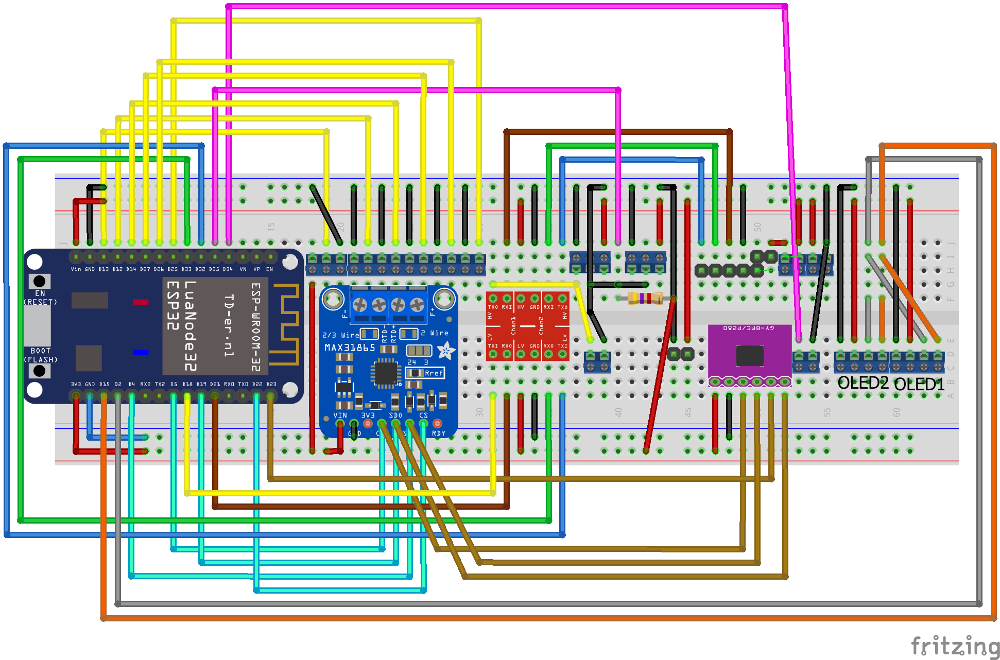
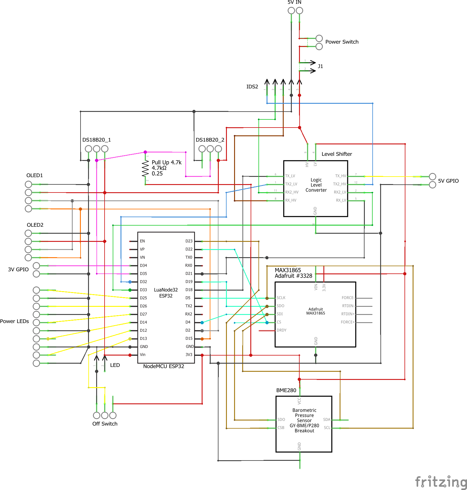
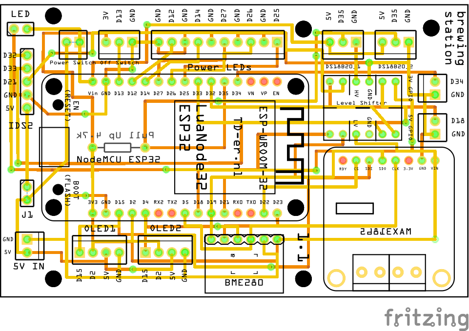

Brewing station for use with induction cooker
=====
This project uses the GGM IDS2 induction cooker, an ESP32 and temperature sensors to be an agitator and sensing station for CraftBeerPi.
The project incorporated different inputs for different sensors types and a couple of outputs for buttons and leds. The idea was to make this project a "remote hands" for craftbeer Pi but with a local interface so that it also can be used without setting up - or using it to fry outside some stuff with manual temperature control :)
Tests were conducted with both CBP 3 and 4. However there is no difference as the communication/API via MQTT remains the same.

Some functionality is still missing or not perfect:
* PID integration
* Sensor handling
* Humidity and pressure MQTT topics
* Runtimers / mashstep display (also needs CBPI adaptions)

## Induction Cooker
Within this project the [GGM Gastro IDS2 induction cooker](https://www.ggmgastro.com/de-de-eur/induktionsherd-3-5-kw-1) is used to heat up the mash tun.
This provides an external control panel which is connected via serial connection. Thanks to [InnuendoPi](https://github.com/InnuendoPi) and his [MQTTdevice2](https://github.com/InnuendoPi/MQTTDevice2), where he reverse engineered the protocol, this can easily be controlled.

## Feature Overview
The following features are part of the current release:
* Network connectivity with Wi-Fi
* OTA support
* Data received/delivered via MQTT
* Syslog support
* GPIOs for buttons and leds
* Two OLED display for data
* Two DS18B20 sensors (temperature)
* One BME280 sensor (temperature / humidity / pressure)
* One PT1000 sensor (temperature)
* Support for GGM IDS2 induction cooker (thanks to Innuendo)

## Used Hardware
* 2x SSD1306 OLED I2C displays - with different addresses
* 2x DS18B20 sensors onewire - silicone
* 1x Adafruit Maxfruit 31865 breakout board
* 1x PT1000 sensor - silicone
* 1x Adafruit BME280 breakout board
* Set of aluminium switches with integrated LEDs

## Configuration
Check the config_example.h and edit it accordingly.

## Breadboard view


## Schematics


## Fritzing PCB / Gerber


## 3D print template
TBD

## Logging output example
```
TBD
```