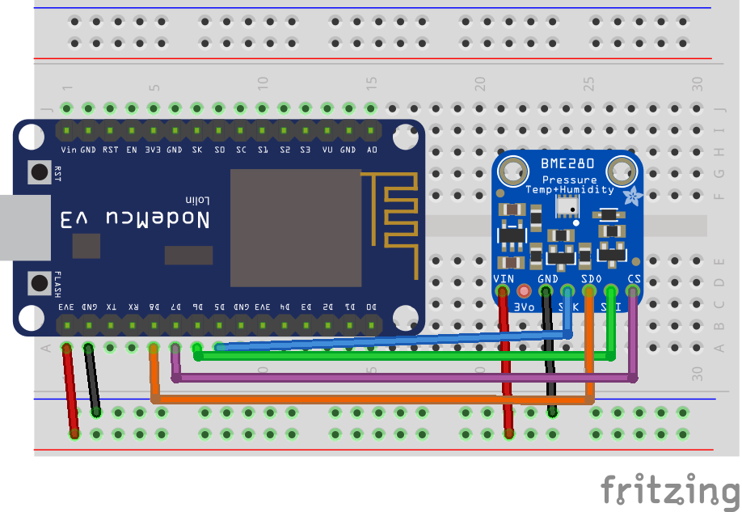
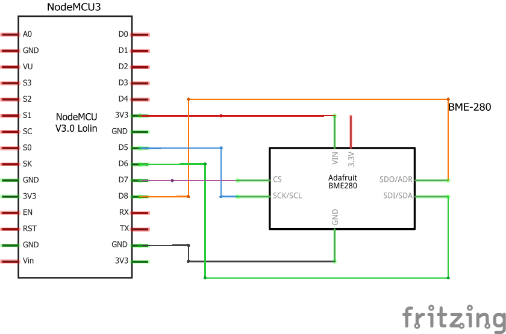

# Bosch BME280 ambient sensor
This example should provide a first start to work with the Bosch BME280 ambient sensor which is e.g. produced by Adafruit.

It is capable of reading temperature, ambient pressure and humidity at once with a quite high precision. And its cheap. So one sensor to rule them all.

I'm using it with the SPI connection in this example.

## Components
* NodeMCU v3 ([Documentation](https://nodemcu.readthedocs.io/en/master/))
* Adafruit Bosch BME280 sensor ([Documentation](https://www.adafruit.com/product/2652))
## Breadboard view

## Schematics

## Logging output example
```
> 12:08:09.400 -> Setup: Starting...
> 12:08:09.448 -> Setup: Successfull!
> 12:08:09.483 -> Temperature = 20.07 °C
> 12:08:09.483 -> Pressure = 935.00 hPa
> 12:08:09.517 -> Humidity = 52.91 %
```