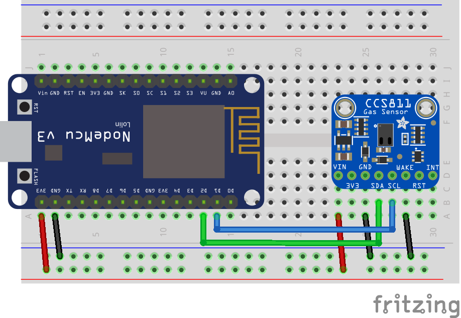
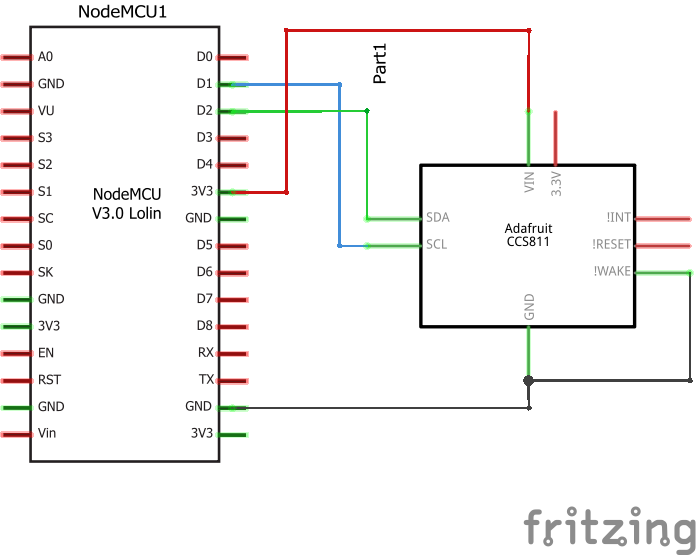

# CCS811 CO2 sensor
This example should provide a first start to work with the CCS811 CO2 sensor which is e.g. produced by Adafruit.

The idea is to use it to read the current CO2 levels and therefore measure the "quality" of the air in the room. This is planned to be a trigger to lazy people to open the windows to breath in some fresh air ;)

It is also able to detect gas but I'm more interested in measuring CO2 here (for my smart home use cases).

## Components
* NodeMCU v3 ([Documentation](https://nodemcu.readthedocs.io/en/master/))
* Adafruit CCS811 sensor ([Documentation](https://www.adafruit.com/product/3566))
## Breadboard view

## Schematics

## Logging output example
```
> 11:35:10.251 -> Setup: Starting...
> 11:35:12.441 -> Setup: Successfull!
> 11:35:12.441 -> CO2: 0ppm, TVOC: 0ppb   Temp:26.00
> 11:35:22.443 -> CO2: 415ppm, TVOC: 2ppb   Temp:23.98
> 11:35:32.450 -> CO2: 415ppm, TVOC: 2ppb   Temp:21.07
> 11:35:42.425 -> CO2: 426ppm, TVOC: 3ppb   Temp:21.56

```