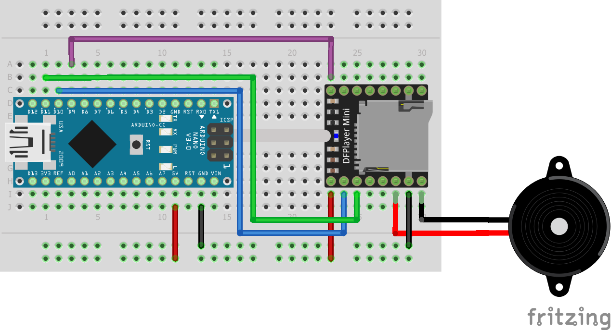
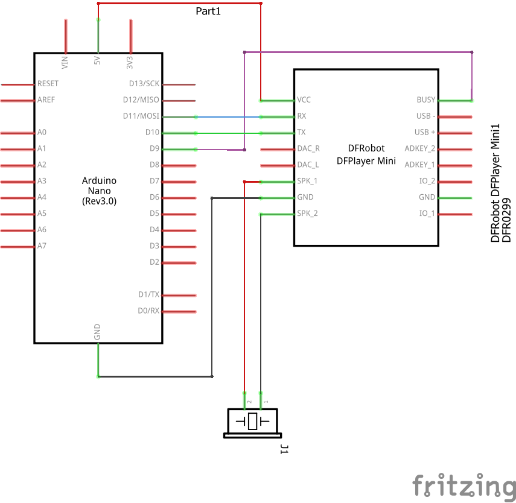

# DFPlayer mini module
This example should provide a first start to work with the DFPlayer mini module.
It's basically a simple audio player which can be triggered via serial or other methods. It supports micro SD cards up to 32GB and can play *.wav or *.mp3 files. A speaker can be connected directly to the module and it needs to be powered by 5V.

Side note: While searching a lot about the module I couldn't get mine to work correctly with my NodeMCUs ESP8266. Therefore I switched to a Arduino Nano which worked fine. But I also came across a couple of posts where two versions of the module were mentioned. There is one with a blue LED and one fake one with a red LED. The gist is that the blue one is the original one and obviously has less problems like noise or serial connection. They can be differentiated (at least if the pictures you are shown are really the ones you get...) by the label on top. The fake one says "DFplayer mini" while the original rather says "TF-16-...".

Another note: The fake one seems to send the "finished" message twice, so you should be aware of that if you are "waiting" for it. Can also be seen on the console.
## Components
* Arduino Nano  ([Documentation](https://nodemcu.readthedocs.io/en/master/))
* DFPlayer mini - fake with red LED ([Documentation](https://github.com/DFRobot/DFRobotDFPlayerMini/raw/master/doc/FN-M16P%2BEmbedded%2BMP3%2BAudio%2BModule%2BDatasheet.pdf))
## Breadboard view

## Schematics

## Logging output example
```
> DFRobot DFPlayer Mini Demo
> Initializing DFPlayer ... (May take 3~5 seconds)
> DFPlayer Mini online.
> Time Out!
> Number:2 Play Finished!
> Number:2 Play Finished!
> Number:3 Play Finished!
> Number:3 Play Finished!
```