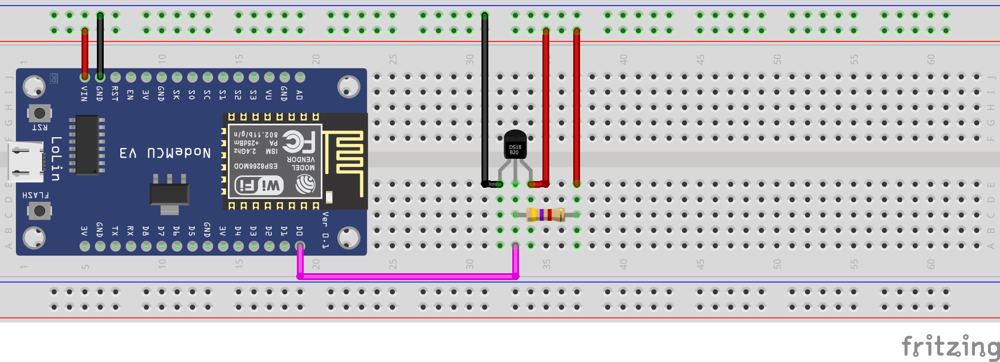
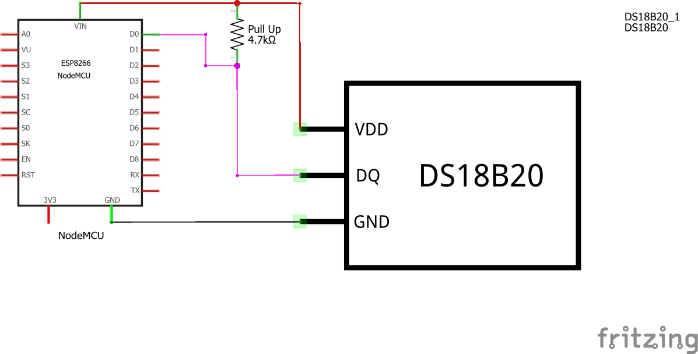

# Maxim Integrated DS18B20 temperature sensor
This example should provide a first start to work with the quite common DS18B20 temperature sensors. The are driven by 5V voltage and make use of the OneWire Bus system.
OneWire supports multiple sensors with only one wire (stating the obvious here...)

I am using a less common version of the sensor in my example as I'm planning to measure water temperature (brewing beer!) which requires the sensors to be water resistant.
There are different versions available but I opted for the version with a silicon tubing as I want to drink the beer afterwards and don't want any plastic parts inside my beer...

The example is mainly based on the one provided by miles here: https://github.com/milesburton/Arduino-Temperature-Control-Library/blob/master/examples/Tester/Tester.pde
Thanks for the cool library!

## Components
* NodeMCU v3 ([Documentation](https://nodemcu.readthedocs.io/en/master/))
* DS18B20 with silicone tubing ([Documentation](https://datasheets.maximintegrated.com/en/ds/DS18B20.pdf))
## Breadboard view

## Schematics

## Logging output example
```
> 13:58:45.450 -> Setup initialised!
> 13:58:45.556 -> Locating devices...Found 2 devices.
> 13:58:45.556 -> Parasite power is: OFF
> 13:58:45.556 -> Found device 0 with address: 288C65FE0B0000EF
> 13:58:45.584 -> Found device 1 with address: 28FFB9F993195A21
> 13:58:45.584 -> Requesting temperatures... DONE!
> 13:58:45.753 -> Temperature for device: 0
> 13:58:45.753 -> Temp C: 24.50 Temp F: 76.10
> 13:58:45.787 -> Temperature for device: 1
> 13:58:45.821 -> Temp C: 23.75 Temp F: 74.75
> 13:58:46.807 -> Requesting temperatures... DONE!
> 13:58:46.977 -> Temperature for device: 0
> 13:58:47.011 -> Temp C: 24.50 Temp F: 76.10
> 13:58:47.045 -> Temperature for device: 1
> 13:58:47.045 -> Temp C: 23.75 Temp F: 74.75
```