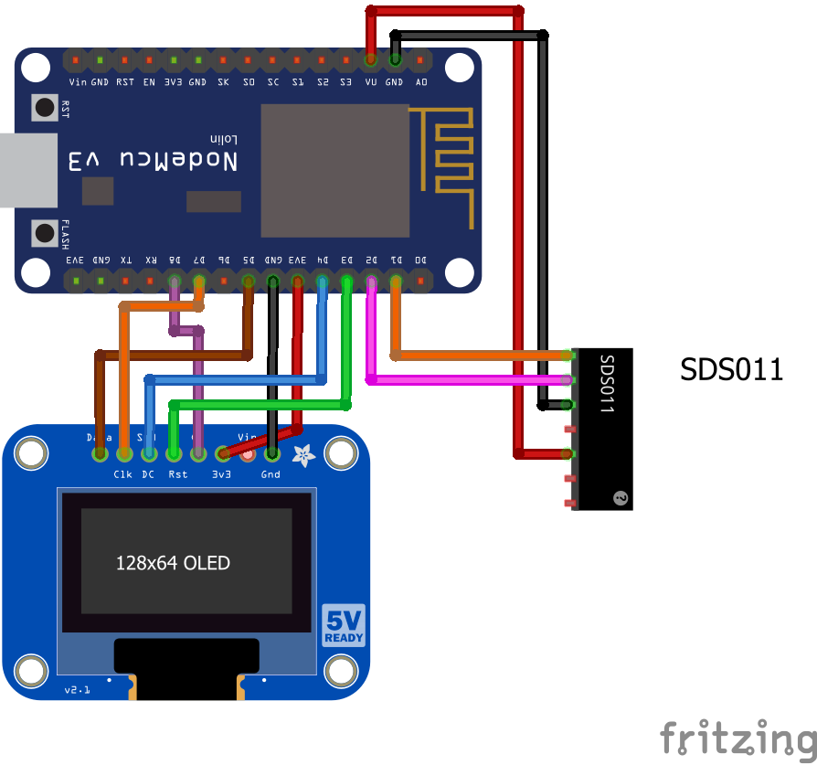

# Dust or smog sensor example
This example should provide a first start to work with the Nova SDS011 dust sensor. 
It basically reads the sensor values every few seconds and outputs the data onto a display. To keep the code rather sleek no Wi-Fi functions are included.
## Components
* NodeMCU v3 ([Documentation](https://nodemcu.readthedocs.io/en/master/))
* NodeMCU base board (optional)
* Nova SDS011 dust sensor ([Datasheet](https://www.google.com/url?sa=t&rct=j&q=&esrc=s&source=web&cd=1&ved=0ahUKEwjKk_vY2qjbAhUEjiwKHYP5D1gQFggoMAA&url=https%3A%2F%2Fnettigo.pl%2Fattachments%2F398&usg=AOvVaw0L3tTLbi_FllDkISzkqxPb))
* SSD1306 SPI display ([Datasheet](https://cdn-shop.adafruit.com/datasheets/SSD1306.pdf))
## Breadboard view

## Schematics

## Logging output example
> Setup: Starting...
Setup: Initializing display
Setup: Successfull!
Waking up sensor...
Warming up sensor for 5000ms...
Reading values...
P2.5: 2.40
P10:  2.60
Go to sleep for 10000ms...
