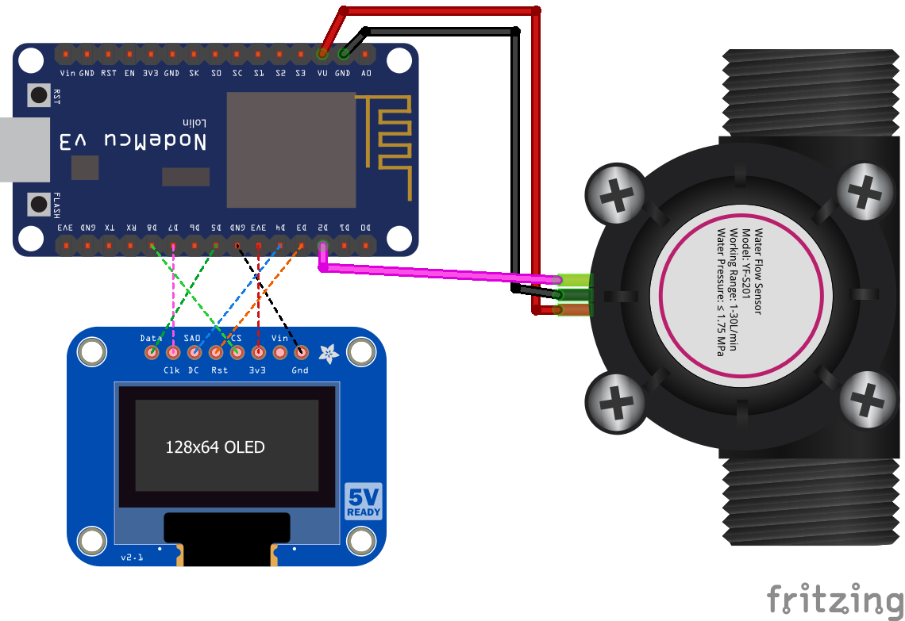
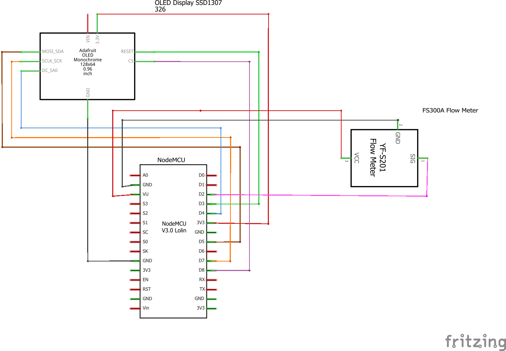

# Water flow sensor example
This example should provide a first start to work with the FS300A water flow sensor.
It basically reads the sensor values every second and outputs the data onto a display. To keep the code rather sleek no Wi-Fi functions are included. Data is being read by counting interrupts arriving at an external GPIO pin and calculating the current water flow and the total amount of water that has been used since the last reset.

## Components
* NodeMCU v3 ([Documentation](https://nodemcu.readthedocs.io/en/master/))
* NodeMCU base board (optional)
* FS300A flow sensor ([Documentation](http://wiki.seeedstudio.com/G3-4_Water_Flow_sensor/))
* SSD1306 SPI display ([Datasheet](https://cdn-shop.adafruit.com/datasheets/SSD1306.pdf))
## Breadboard view

The displayed fritzing part shows another sensor but is similar. Part is taken from this [Blog](http://omnigatherum.ca/wp/?p=87).
## Schematics

## Logging output example
```
> Setup: Starting...
> Setup: Initializing FS300A sensor..
> Setup: Initialising display
> Setup: Successfull!
> Current volume: 0 liters/hour
> Total volume:  0 liters
```