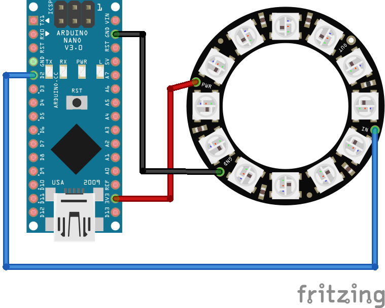
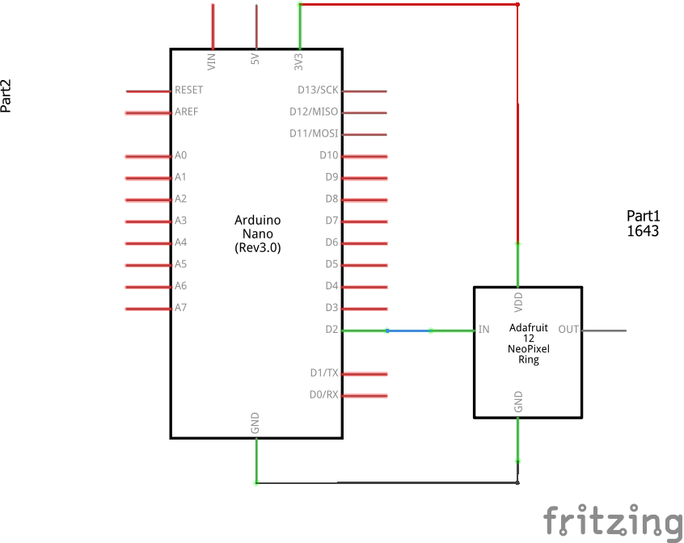

# WS2812 LED ring
This example should provide a first start to work with the WS2812 LED Rings e.g. distributed as Adafruit NeoPixels
I've got a few of them in different sizes and chose the one with 12 LEDs for this example. I've altered the Adafruit examples a bit and created new patterns I needed for my other projects.

Note: Works fine with Arduino Nano and ESP8266. There are also additional modules which let you attach them directly to a small ESP-01 module.
## Components
* Arduino Nano ([Documentation](https://nodemcu.readthedocs.io/en/master/))
* WS2812 12x LED Ring ([Documentation](https://www.adafruit.com/category/168))
## Breadboard view

## Schematics

## Logging output example
```
> Example for WS2812 LED ring using Pin '2'
> Setup done!
> Mode: MovingDot
> Mode: ColorBlink
> Mode: ColorRotate
> Loop Done!
```