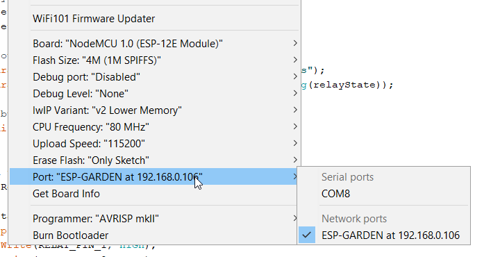

# OTA example
This example is based on the ArduinoOTA library and the provided "BasicOTA" example. 
Check: https://github.com/esp8266/Arduino/tree/master/libraries/ArduinoOTA/examples/BasicOTA

It basically listens for a new firmware all the time and uploads it to the flash when a new one is available and downloaded.

## Device Configuration
In the project you first need to define/edit:
* Wi-Fi SSID
* Wi-Fi password
* Device hostname
* Device admin password

The admin password will be required by your IDE when you start uploading a new sketch/firmware to the remote Arduino. Everything else should be self explanatory.

## IDE Configuration
Make sure ...
* to have the ArduinoOTA library installed in your IDE
* you've flashed the sketch onto your ESP8266
* your ESP8266 is running correctly and is logged into your Wi-Fi
* to restart your IDE to make sure it checks for Wi-Fi connected and OTA enabled Arduinos BEFORE it launches
* to select the right ESP8266 from the list - check the picture below



## Components
* NodeMCU v3 ([Documentation](https://nodemcu.readthedocs.io/en/master/))
* NodeMCU base board (optional)
## Logging output example
A new sketch is available:
```
> OTA: Start updating sketch
> OTA Progress: 100%
> OTA End
```

Reboot of the board:
```
> Project version: 1.0
> Setup initialised!
> Connected to Wi-Fi!
> Local IP address: 192.168.0.106
> Hostname: ESP-GARDEN
> OTA setup successfull!
```