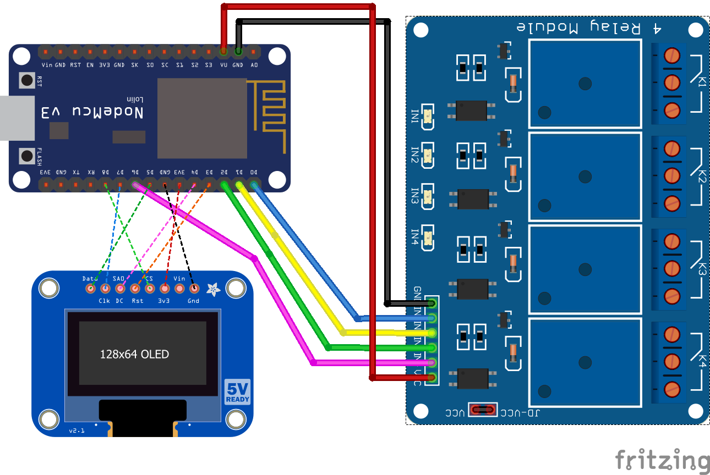
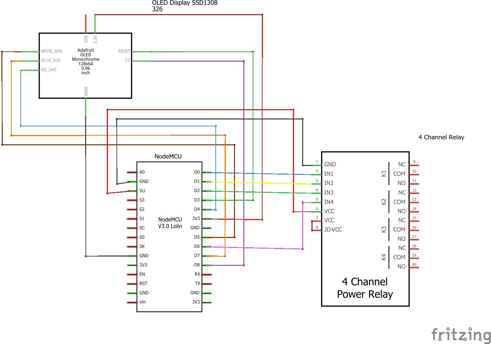

# Relay example
This example should provide a first start to work with a 4 channel relay module.
It basically toggles the state of all relays every second between ON/OFF. To keep the code rather sleek no Wi-Fi functions are included.
When the relay switches, a notification led is turned on.
According to different sources the relays consume around 15-20mA when being idle and up to ~65mA when turned on. Keep that in mind that you should use a powerfull enough power supply.
NOTE: You should also consider connecting the power supply with 5V directly to the relay instead of (as shown in the schematics) using the NodeMCU Vin as power source.

## Components
* NodeMCU v3 ([Documentation](https://nodemcu.readthedocs.io/en/master/))
* NodeMCU base board (optional)
* SainSmart 4 channel relay module ([Website](https://www.sainsmart.com/products/4-channel-5v-relay-module)
* SSD1306 SPI display ([Datasheet](https://cdn-shop.adafruit.com/datasheets/SSD1306.pdf))
## Breadboard view

The displayed fritzing part is taken from this [Blog](http://omnigatherum.ca/wp/?p=338).
## Schematics

## Logging output example
```
> Setup: Starting...
> Setup: Initialising relay pins...
> Setup: Setting all relays to OFF...
> Setup: Initialising display
> Setup: Successfull!
> 0: Switching relays to FALSE/OFF
> 1: Switching relays to TRUE/ON
> 2: Switching relays to FALSE/OFF
> 3: Switching relays to TRUE/ON
> 4: Switching relays to FALSE/OFF
```