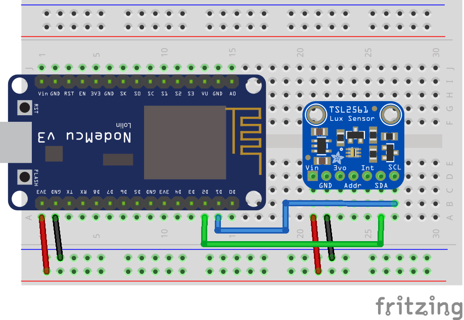
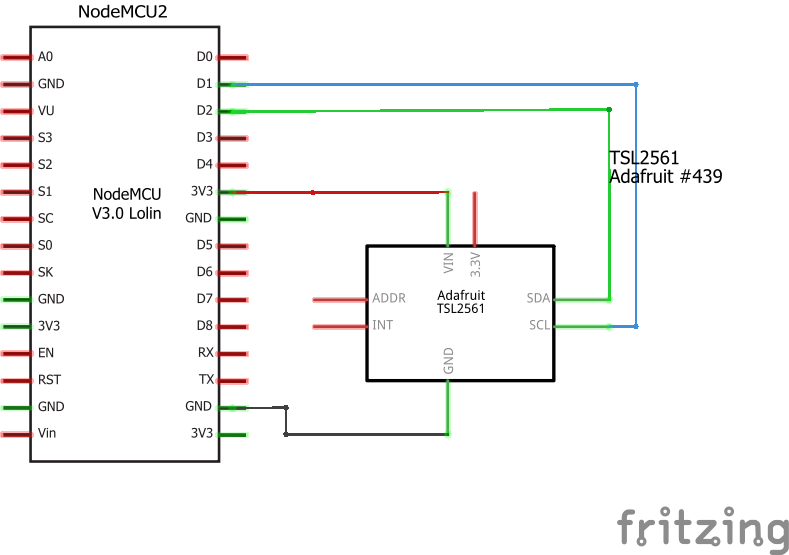

# TSL2561 brightness / light sensor
This example should provide a first start to work with the TSL2561 brigthness sensor which is e.g. produced by Adafruit.

It measures the brightness in lux and I'm going to use it in different scenarios. E.g. to check if the lights in a room are on or if the dishwasher (which has a bright LED facing the kitchen floor when its on) is finished.

## Components
* NodeMCU v3([Documentation](https://nodemcu.readthedocs.io/en/master/))
* Adafruit TSL2561 sensor ([Documentation](https://www.adafruit.com/product/439))
## Breadboard view

## Schematics

## Logging output example
```
> Setup: Starting...
> Setup: Successfull!
> Brightness = 7.00 lux
> Brightness = 8.00 lux
> Brightness = 41.00 lux
> ...
```