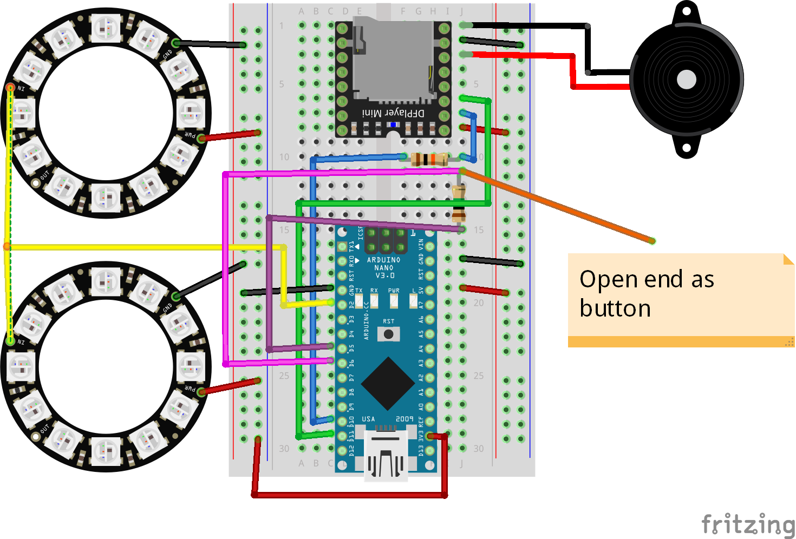
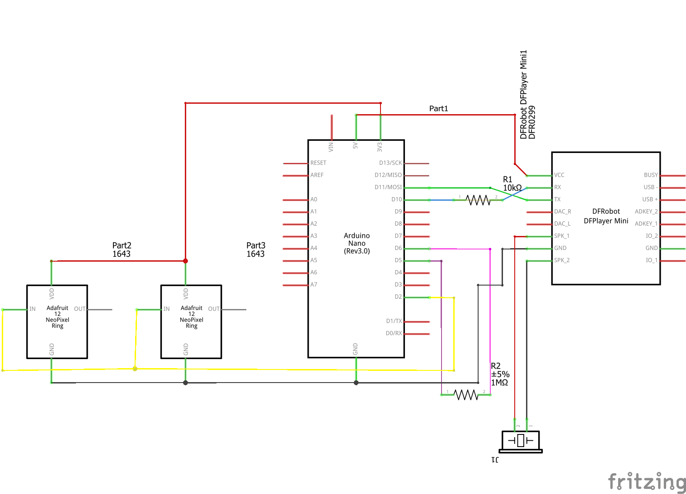

# Harry Potter sorting hat
This Arduino project copies the sorting hat from the harry potter series which selects the house for every pupil in Hogwarts. 

It features a DFPlayerMini to play sounds, a simple 2W loudspeaker and two WS2811B LED rings (neopixel) which show waiting animations and the selected house for all the people standing around the hat.

Note: For better sorting you should name your MP3s like "0001-house-gryffindor" / "0002-house-hufflepuff" and so on.

Note: Depending on your playback/loudspeaker quality and volume you should manipulate your MP3s and make them e.g. "louder".

Note: The DFPlayerMini needs a microSD card with MP3s in a certain "way". This is what I did:

1. Format the SD card as Fat32

2. Create a folder called "MP3" on the sdcard

3. Copy the MP3s one by one by hand on to the sd card. The order is important! Because you control what MP3 you play with this sequence. E.g. if you want to play the third MP3 file you copied you use "3" in the code... and so on.


## Components
* Arduino Nano  ([Documentation](https://nodemcu.readthedocs.io/en/master/))
* DFPlayer mini - fake with red LED ([Documentation](https://github.com/DFRobot/DFRobotDFPlayerMini/raw/master/doc/FN-M16P%2BEmbedded%2BMP3%2BAudio%2BModule%2BDatasheet.pdf))
* 2x WS2811B neopixel LED rings with 12 LEDs
* Loudspeaker
* 1M Resistor
* 10K Resistor

## Breadboard view

## Schematics

## Logging output example
```
> TBD
```